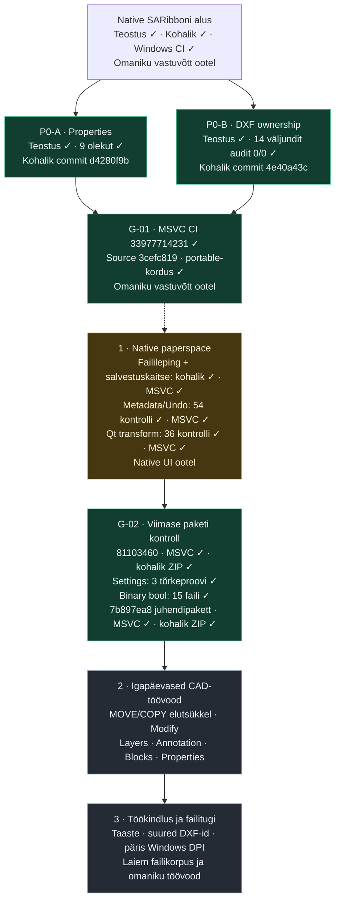
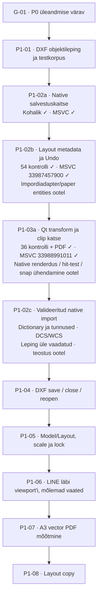

# Kuubik Draw Native roadmap

## Jälgitav tööplaan

**Uuendatud:** 2026-09-06 00:10 EEST. **Vastutaja:** Codex.
**Seis:** `7b897ea8` läbis [Windows CI 33991361757](https://github.com/T3stin-svg/kuubik-draw-native/actions/runs/33991361757), ZIP-i SHA/manifesti ja kohaliku täiskorduse. Järgmine teostus on P1-02c.
**Tööaken:** 5.09 kell 19:10 kuni 6.09 kell 00:10 EEST; Reio kinnitas 5 h arendust.

- **Teostatud ja kohalikult kontrollitud:** Properties, PLOTSETTINGS, piiratud
  layout-failileping, native salvestuskaitse, metadata/Undo (54 kontrolli),
  Qt kaamera alus (36 kontrolli), settings-tõrgete diagnostika (3 juhtu)
  ning binary-DXF bool-parandus (15 väljundit, audit 0/0).
- **Kontrollitud Windowsi pakett:** parandatud juhend, täpne source/CI/SHA,
  native ja sõltumatud katsed läbitud. Omaniku vastuvõtt on eraldi ootel.
- **Järgmisena:** valideeritud DXF impordiadapter koos tunnuste ja DCS/WCS
  kaameraseosega; seejärel native save/close/reopen. Model/Layout sakid,
  viewport'i kaudu muutmine ja native layout-PDF on veel tegemata.

[Kontrollide aruanne](TEST_REPORT.md) · [5 h tööplaan](../tasks/plan.md) · [Omaniku katse](OWNER_REVIEW.md)

✓ tähendab ainult sõnaselgelt nimetatud kontrolli läbimist. Tulevikuetappide
protsente ega tähtaegu ei ole oletatud. Reprodutseeritav P0 viga tõuseb järjekorra ette.

| Töö | Teostus | Kohalik kontroll | Windows MSVC CI | Omaniku vastuvõtt |
|---|---|---|---|---|
| SARibboni alus, `d35ec354` | Valmis | Läbitud | Läbitud: `33966232573` | Ootel |
| P0-A Properties | Valmis | 9/9 olekut | Läbitud: `33977714231` | Ootel |
| P0-B PLOTSETTINGS | Valmis | 14 väljundit: audit 0/0 | Läbitud: `33977714231` | Ootel |
| libdxfrw piiratud failileping | P1-01a/b lugemine ja P1-01c kirjutus valmis; native impordi/ekspordi ühendamine puudub | Kirjutuse 9 väljundit audit 0/0, 21 tõrkejuhtu; native GUI/failiregressioon ✓ | Lugemine: `33981465387`; päis/kirjutus: `33983851259` | Puudub |
| P1-02a native salvestuskaitse | Valmis | 22 juhtu | Läbitud: `33986140500` | Ootel |
| P1-02b metadata ja Undo alus | Valmis; import/UI ootel | 54 kontrolli | Läbitud: `33987457900` | Ootel |
| P1-03a Qt kaamera alus | Valmis; native renderdus ootel | 36 kontrolli ja 6 negatiivset PDF-proovi | Läbitud: `33988991011` | Ootel |
| Settings-tõrgete diagnostika | Valmis | 3 tõrkejuhtu; täis-GUI ✓ | Läbitud: `33990304131` | Ootel |
| F-01 binary bool | Valmis | 15 väljundit audit 0/0 | Läbitud: `33990304131` | Ootel |
| AutoCADi-laadsed MOVE/COPY töövood | Planeeritud; native alus olemas | Täielik töövoog tõendamata | Täielik töövoog tõendamata | Puudub |
| Laiem töökindlus ja failitugi | Planeeritud | Osaline senine korpus | Osaline senine korpus | Puudub |

## Läbitud alus — P0 parandused ja omaniku vastuvõtt

### P0-A · Propertiesi dokumendikokkuvõte

**Seis:** teostatud ja lokaalselt kontrollitud; commit `d4280f9b`.

- [x] Leida muutmisteavituse juurpõhjus ja asjakohased kutsujad.
- [x] Kasutada native dokumenditeavitust; vältida timer'it, polling'ut ja teist mudelit.
- [x] Lugeda ainult aktiivsed entity'd, välistades Undo tõttu alles hoitud objektid.
- [x] Kontrollida LINE → save ning PLINE → save → Undo → save → Redo → save.
- [x] Kontrollida kõiki 9 entity/Modified olekut: enne parandust 8 viga, pärast 0.
- [x] Säilitada selection, layer, MDI ja native Undo/Redo töövood.
- [x] Läbida sama lähtekoodi Windows MSVC CI ja portable-kordus.
- [ ] Reio kontrollib tegelikus töövoos entity count'i ja Modified-näitu.

**Lõpetamise tingimus:** õige näit pärast iga nimetatud tegevust, olemasolevad
töövood säilinud ning uus Windowsi artifact sama lähtekoodiga tõendatud.

### P0-B · PLOTSETTINGSi DXF ownership

**Seis:** teostatud ja lokaalselt kontrollitud; commit `4e40a43c`.

- [x] Luua audit-clean sünteetiline modelspace-sisend; vana fixture säilitada.
- [x] Reprodutseerida enne parandust repair 202, mitte lugeda ainult geomeetriat.
- [x] Lisada ACAD_PLOTSETTINGS dictionary, owner, reactor ja unikaalsed kirjevõtmed.
- [x] Kontrollida 0, 1 ja 2 PLOTSETTINGS-objekti ning sama writer'i korduskasutust.
- [x] Nõuda puhtalt sisendilt ja 14 väljundilt 0 audit error'it ning 0 repair'i.
- [x] Kontrollida geomeetria, kihtide, ühikute, margin'ite ja native reopen'i säilimist.
- [x] Jälgida binary-DXF päise viga eraldi tööna F-01; kohalik ja MSVC kontroll läbitud.
- [x] Läbida sama lähtekoodi Windows MSVC CI ja portable-kordus.
- [ ] Reio kontrollib sünteetilise DXF-i avamist, muutmist ja taasavamist.

**Lõpetamise tingimus:** PLOTSETTINGS säilib ka sõltumatu auditi mälus;
ownership on korrektne ja nimetatud ASCII-korpus ei vaja struktuuriparandusi.
See ei tähenda suvalise DXF-i täielikku kadudeta tuge.

### G-01 · Windowsi tõend ja omaniku kontroll

**Seis:** täpse lähtekoodi Windows CI ja kohalik portable-kordus läbitud.

- [x] Reio lubas tööharu push'i ja olemasoleva Windowsi CI käivitamise.
- [x] Push täpsele tööharule; MSVC x64 / Qt 5.15 build source `3cefc819`.
- [x] Native GUI, Properties, DXF, PDF/SVG ja standalone ownership-testid läbivad CI-s.
- [x] CI portable kaust sisaldab õigeid runtime-faile, litsentse ja build-manifesti.
- [x] CI-s paketi enda Qt pluginad, isoleeritud profiilid ja muutumatu register tõendatud.
- [x] ZIP/SHA-256, CI run ja source commit on omavahel kontrollitud (TEST_REPORT).
- [x] Kohalik portable-kordus läbitud; native/Qt profiilid isoleeritud, register muutumatu.
- [ ] Reio vastuvõtt.

**Värav ei anna release'i või remote merge'i luba.** Uus MSVC-tõend on
`3cefc819` / run `33977714231`; see ei kata järgnevaid P1 koodimuudatusi.

## Järgmisena — native paperspace

**P1-01 failileping, P1-02a kaitse, P1-02b metadata ja P1-03a kaamera alus läbitud. Native ühendamine ja UI on ootel.** Detailne tehniline alus:
[PAPERSPACE_PLAN](PAPERSPACE_PLAN.md). Enne arhitektuuri teostamist tehakse stage 0
ülevaatus koos planning/doubt-driven oskustega. Üks RS_Graphic ja üks native Undo
jäävad kõigis sammudes ainsaks mudeliks.

| ID | Töö ja tulemus | Vastuvõtukriteerium | Sõltub |
|---|---|---|---|
| P1-01 | LAYOUT, VIEWPORT, BLOCK_RECORD ja layout'i PLOTSETTINGS lugemise/kirjutamise leping | Sünteetilised failid katavad ID-d, owner'id, seosed, ühikud ja toetamatute objektide piirid; sõltumatu audit on 0/0 | Stage 0 ülevaatus |
| P1-02 | Native layout'i ja viewport'i omand ning eluiga | Üks RS_Graphic; layout TEST; ühine mudel; native Undo taastab lisamise/kustutamise ilma dangling pointer'ite või teise entity-mudelita | P1-01 |
| P1-02c | Valideeritud native import ja identiteediseosed (järgmine) | Sama allikas, tegelik dictionary/owner, eraldi viewport nr 1, DCS/WCS geomeetriline kontroll, ohutu eluea lõpp; Save-kaitse säilib | P1-01 + P1-02b + P1-03a |
| P1-03 | Ühine model↔paper teisendus | Renderdus, hit-test, snap ja PDF kasutavad sama teisendust; 0°/30°, inverse, clipping ja ühikud läbivad kontrolli | P1-02 |
| P1-03a | Qt teisenduse arvuline alus (läbitud) | WCS↔Y-üles paber mm; mõõtkava, pööre, inverse, arvuliste vigade keeld ning raster/vector clip-katse; ei lõpeta native UI töövoogu | P1-02b väärtusmudel |
| P1-04 | Layout/viewport DXF roundtrip | Save → close → reopen säilitab ID-d, owner'id, mõõtkavad ja lukud; geomeetria säilib ning sõltumatu audit on 0/0 | P1-01–03 |
| P1-05 | Model/Layout sakid, scale ja lock | A3 landscape TEST; kaks ligikaudu 160×160 mm viewport'i; 1:50 ja 1:100; sõltumatu camera; lock peatab wheel zoom'i mõju scale'ile | P1-04 |
| P1-06 | Mudeli muutmine läbi viewport'i | Topeltklõps sees → ModelThroughViewport, väljas → Paper; LINE ilmub mõlemas vaates; üks Undo/Redo uuendab mõlemat | P1-03–05 |
| P1-07 | Mõõtkavatäpne vektor-PDF | 1:1 A3 paber; 5000 mm LINE mõõdab vastavalt 100 ja 50 mm; tolerants ≤0,05 mm; geomeetria ei ole raster | P1-04–06 |
| P1-08 | Layout copy | Koopia saab eraldi layout/viewport ID-d, näitab sama mudelit ning säilitab oma camera, scale'i ja lock'i ka reopen'i järel | P1-07 põhivoo tõend |

P1-01 alametapid: **a)** viewport'i camera väljad ja testid — kohalik/MSVC läbitud;
**b)** LAYOUT/BLOCK_RECORD lugemine — kohalik/MSVC läbitud; **c)** terviklik ownership'i kirjutus,
tunnuste säilitamine, failiasenduse veakaitse ja sõltumatu 0/0 audit — kohalik/MSVC läbitud.
Üks alametapp ei märgi kogu P1-01 tööd läbituks.

**P1 koondvastuvõtt:** kõik kaheksa rida ei ole üks automaatne PASS. Põhislice'i
värav on P1-01–07 ühine native töövoog, sõltumatu DXF/PDF mõõtmine, Windows CI
ja Reio katse. Layout copy tuleb alles pärast põhivoo tõendamist.

**Esimesest slice'ist väljas:** DWG/XREF, annotative scale, mitteristkülikuline
clipping, 3D ja uus PDF runtime. Kasutaja layout-DXF-e ei kirjutata üle enne
tõendatud roundtrip'i; katsed kasutavad sünteetilisi faile või koopiaid.

## Seejärel — igapäevased CAD-töövood

**Seis:** native käsud on osaliselt olemas; allolev täielik AutoCADi-laadne
kasutusjada pole veel tõendatud. Järjekord järgib praegust kinnitatud suunda;
omaniku reprodutseeritud regressioon tõuseb kohe ette.

| ID | Funktsioonirühm | Konkreetsed tööd | Millal saab kontrolli läbituks märkida? |
|---|---|---|---|
| C-01 | MOVE | Valik → base point → target point; pointer ja koordinaadisisend; native preview/commit | Enter/Esc, lõppgeomeetria, üks Undo ning DXF reopen läbivad sama töövoo; praegune dialoogipõhine test üksi ei piisa |
| C-02 | COPY | Valik → base point → target point; kopeerimise jätkamine ja lõpetamine | Originaal säilib, koopiad on õigetes punktides; ühine Undo/Redo ja reopen; praegune in-place duplikaat üksi ei piisa |
| C-03 | OFFSET | Kaugus, lähteobjekt, pool; LINE/PLINE/ARC toetuse piiride kontroll | Mõõdetud kaugus, native geomeetria ja Undo/reopen on õiged; piirangud nähtavad |
| C-04 | TRIM ja EXTEND | Piiride valik, lõigatava/pikendatava osa määramine, tühistamine | Lõikepunktid ja säiliv geomeetria on sõltumatult kontrollitud, üks native Undo taastab lähteoleku |
| C-05 | FILLET | Raadius, kahe objekti valik, preview ja commit | Raadius/tangents ning lõigatud osad vastavad sisendile; Undo/Redo ja reopen säilivad |
| C-06 | ROTATE ja ERASE | Base point/nurk; valiku kustutamine | Täpsed koordinaadid või aktiivsete üksuste eemaldamine; üks Undo; Properties uueneb |
| C-07 | CIRCLE, ARC, RECTANGLE | Native pointer-testid, valikud ja koordinaadid | Nähtav käivitamine → canvas → päris entity → save/reopen; olemasolev nupp üksi ei ole tõend |
| L-01 | Layers | Color, visibility, lock, lineweight; current-layer ja entity omaduste kooskõla | Joonistamine kasutab õiget kihti; peidetud/lukustatud kihi töövood ja DXF taasavamine on tõendatud |
| A-01 | Text | Ühe- ja mitmerealine tekst, stiilid, muutmine, fondiasenduse piirid | Sisu, asukoht ja stiil säilivad; vector PDF ja reopen on kontrollitud |
| A-02 | Dimensions ja leaders | Mõõdutüübid, stiilid, täpsus ja juhtjooned | Mõõdetav väärtus vastab geomeetriale ning ei muutu save/reopen/PDF järel |
| A-03 | Hatch | Piirid, muster, scale/angle ja muutmine | Kinnised piirkonnad, avad, Undo ja eksport läbivad määratletud korpuse |
| B-01 | Blocks | Create, insert, edit, explode ja atribuutide toetuse piirid | Native blokkide seosed ja geomeetria säilivad Undo/Redo ning DXF roundtrip'is |
| PR-01 | Muudetav Properties | Ühe ja mitme valiku muudetavad omadused, segaväärtused | Muudatus läbib native tegevust ja ühist Undo't; valik/MDI/layer säilivad; read-only aluse olemasolu ei ole lõpptulemus |

Kõigi ridade ühine nõue: olemasolevad QAction/ActionHandler ja native entity'd,
üks dokumendimudel, sama preview/commit-geomeetria, Enter/Esc ning vajalik
command-line/dynamic-input/snap-käitumine. Täpset toetatud alamhulka laiendatakse
tõendite järgi; terve käsurühm ei saa ühe juhtumi põhjal rohelist staatust.

## Hiljem — töökindlus, visuaalne vastavus ja failikorpus

| ID | Töö | Praegune seis | Vastuvõtuvärav |
|---|---|---|---|
| F-01 | Binary-DXF tõeväärtuse baidilaius | 17 parandatud kutset; 15 binaarset väljundit native reread ja audit 0/0; MSVC `33990304131` läbitud | Määratletud korpus läbitud; ei lisa native binary Save As'i ega üldist binary sertifikaati |
| F-02 | Tundmatute/puudulikult toetatud DXF objektide ohutus | Täielik kadudeta säilimine tõendamata | Objekte ei kaotata vaikselt; toetatud säilitamine või selge ohutu piirang, sõltumatu korpus |
| R-01 | Autosave ja recovery | Pärandatud aluse töökindlus vajab eraldi tõendit | Katkestus/crash → taastamine säilitab lubatud töö; originaalfaili ei rikuta |
| R-02 | Suured DXF-id ja mälu | Suure korpuse benchmark puudub | Lepitakse kokku realistlikud joonised ja piirid; mõõdetakse open, edit, Undo, save ja mälu |
| R-03 | Puuduvad fondid ja linetype'id | Laiendatud korpus puudub | Ettearvatav asendus/hoiatus; geomeetria ja faili ohutus säilivad |
| V-01 | Päris Windows DPI ja mitu monitori | Qt 100/125/150% katsed olemas; Windows Settings kontroll puudu | Füüsilised kuva-/DPI-muutused, liikumine monitoride vahel, tab order ja puuduv clipping |
| V-02 | AutoCAD 2024.1.2 paigutuse ja töövoo võrdlus | SARibboni kontrollitud osad olemas; täielik vastavus tõendamata | Sama oleku võrdlused ja omaniku töövood; privaatseid referentse ega Autodesk vara ei avaldata |
| F-03 | Laiem DXF/DWG/DWT/XREF hinnang | Eksperimentaalne / sertifitseerimata | Tasuta ja GPLv2-ga ühilduv tee, ulatuslik säilivuskorpus, packaging/licensing enne runtime-valikut |
| REL-01 | Uus avalik preview / installer / allkirjastamine | Eraldi otsus; praegu luba puudub | Täpse lähtekoodi CI, native töövood, failiaudit, runtime/litsentsid, Gitleaks, SHA-256 ja omaniku avaldamisluba |

Tasulised ODA/RealDWG/ARES SDK-d, teine CAD-mootor ning 3D/BIM ei ole plaani osa.
ACadSharp on ainult uurimiskandidaat; praegusele tootele ei lisata .NET runtime'i.

### Uuendamise kokkulepe

See fail on jälgimiseks avatud püsiv plaan. Arendaja uuendab ajatembrit, aktiivset
töö-ID-d, märkeruute ja tõendiviiteid töö alustamisel,
testitulemuse saabumisel, commit'i järel ning blokeeringu või järjekorra muutumisel,
samas tööetapis, mitte alles lõpparuandes. Uus funktsioon saab kohe rea või etapi.
Teostus, kohalik kontroll, Windows CI ja omaniku vastuvõtt jäävad eraldi.
Vestluses näidatud skeem on avaldamishetke seis; sama faili vaade on jooksev plaan.
Ajahinnang lisatakse alles konkreetse slice'i ulatuse ja võimekuse hindamise järel.

Tõendid: [P0_CORRECTIONS](P0_CORRECTIONS.md), [TEST_REPORT](TEST_REPORT.md).

### Viimased muudatused

- 2026-09-05: P0-A kohalik commit; 9/9 Propertiesi kontrolli läbitud.
- 2026-09-05: P0-B neli adapteri- ja kümme GUI-väljundit audit 0/0; CI ootel.
- 2026-09-05 18:55 EEST: Reio soovil lisatud detailne graafiline järjekord,
  püsivad töö-ID-d, kontrollkriteeriumid ja jooksva uuendamise kokkulepe.
- 2026-09-05 19:03 EEST: P0-B commit `4e40a43c`; aktiivne töö liikus G-01 väravale.
- 2026-09-05 19:10 EEST: Reio kinnitas järgmise 5 h arenduse; P1-01 stage 0 ja
  kohalik faililepingu töö algas. G-01 luba ja MSVC tõend jäävad eraldi ootele.

Varasema UI-etapi päevik: [DEVELOPMENT_PLAN](DEVELOPMENT_PLAN.md).
Tasuta komponentide valiku ja piirangute alus: [RESEARCH_NOTES](RESEARCH_NOTES.md).

Selle tööakna varasemad sündmused ja vahetulemused

**Varasemad vaheolekud kronoloogilises järjekorras:** P0 lähtepunkt `3cefc819` läbis Windows MSVC CI
[33977714231](https://github.com/T3stin-svg/kuubik-draw-native/actions/runs/33977714231).
P0 kohalik portable-kordus ja sõltumatu DXF/PDF/SVG kontroll läbivad.
Viewport'i kaameraväljad ja ülevaatuse täiendused on kohalikus commit'is `04a0f55a`.
Layout'i lugeja läbis 4 positiivset ja 7 vigase andmegrupi juhtu ning kogu native build'i.
Commit `f2879c5b` läbis [CI 33981465387](https://github.com/T3stin-svg/kuubik-draw-native/actions/runs/33981465387): MSVC build, native GUI, failikontroll ning camera/layout'i lugeja regressioonid.
DXF 2018 päise parandus läbis red/green testi ja on kohalikus commit'is `4a1c4e42`.
P1-01c ülevaatuse parandused ja lõplik kohalik failitest läbivad: 4 sisendit × 2 salvestust,
UTF-8 nimi/lehesätted, hõredad/kattuvad tunnused, nähtavus ja raw-seosed + audit 0/0.
21 tõrkejuhtumit kaitsevad sihtfaili, sh päriselt lukustatud fail, erandid ja tunnuste ammendumine.
Katkenud legacy-pildi kirjutuse järel ei kandu vana olek järgmisse eksporti.
Camera, layout'i lugeja ja PLOTSETTINGS regressioonid läbivad. Native build, GUI,
DXF/PDF/SVG, 4 ribboni mõõdukontrolli ja 8 isoleeritud profiili läbivad; register muutumatu.
Kirjutuse commit `6e49a93a` on push'itud pärast Gitleaks/diff-kontrolli;
[Windows CI 33983851259](https://github.com/T3stin-svg/kuubik-draw-native/actions/runs/33983851259) läbitud: MSVC, GUI ja faililepingud.
Uus alamülesanne P1-02a: peatada native salvestamisel veel toetamata paperspace'i vaikne kaotus.
Sellele järgneb dokumendi layout-registri ja olemasoleva Undo ühendamine.
Salvestuskaitse native RED on kinnitatud: 11/12 kontrolli ebaõnnestusid, sh layout'ide
ja varukoopia kaotus. Kaitse on teostatud Save/Save As/autosave/file-export piiril;
native build ja kolm esimest kaitsejuhtu läbivad. Ülevaatuse järel lisanduvad
kõrvale jäetud entity, 102-skoobi, R12 null-owner, ühilduvusimpordi ja UI autosave'i regressioonid.
Ühise entity-parseri 12 konteksti, vigaste gruppide keeld ja nested-grupi kirjutus läbivad.
Varasemad camera/layout/ownership/PLOTSETTINGS testid läbivad uuesti. Kogu native
kaitsekorpus läbib 22 avamisjuhtu: 16 × 15 kaitsekontrolli ja 6 tavalist mudelisalvestust.
GUI, DXF/PDF/SVG ja neli ribboni kontrolli läbivad; register muutumatu.
Kaitse commit `fcad4372` on pärast Gitleaks-kontrolli push'itud;
[MSVC CI 33986140500](https://github.com/T3stin-svg/kuubik-draw-native/actions/runs/33986140500) läbitud; paketi kohalik kordus on ettevalmistuses.
P1-02b ülevaatus nõuab ühe metadata-snapshot'i koondamist Undo tsükli kohta,
ajaloo nullimist enne dokumendi sisu kustutamist ning kaitset ka uutele native layout'idele.
Uue dokumendi Undo-viidete viga on RED-testiga kinnitatud ja parandatud.
Native layout/viewport väärtusregister, tsükli omandiga metadata ja 42 eluea/Undo
kontrolli läbivad; sama build'i native GUI läbib 8 isoleeritud profiiliga.
P1-02b impordiadapter ja UI pole veel ühendatud. Ülevaatuse parandused lisavad
elusa sama tüübi ID kontrolli, ainult const Undo-vaatluse ja eri tsüklite koostöö testi.
Lõplik metadata/Undo test läbib 54 kontrolli; kogu GUI, 22 salvestuskaitse juhtu,
DXF/PDF/SVG ja neli ribboni mõõdukontrolli läbivad uuesti.
Metadata/Undo commit `a601e807` läbis [MSVC CI 33987457900](https://github.com/T3stin-svg/kuubik-draw-native/actions/runs/33987457900).
Eelneva kaitsepaketi `fcad4372` ZIP, SHA-256 ja manifest klapivad; kohalik portable-kordus
läbib native GUI ja sõltumatu DXF/PDF/SVG kontrolli, 10 isoleeritud profiili, register muutumatu.
P1-03a värske ülevaatus lisas pöördmaatriksi overflow, suure koordinaadi täpsuse,
Y-üles pöördemärgi, 320×160 mm raami ja täpse pööratud clip'i kontrollid.
Qt maatriksi/PDF katse on teisenduse alus; native layout-renderdaja, sakid ja plot-töövoog ootavad.
P1-03a RED kinnitas kolme arvulist viga: raami kokkuvajumine, keskpunkti nihke kaotus
ja determinandi overflow. Parandus keeldub neist; sama valideerimine kaitseb nüüd native registrit.
GREEN läbib 34 native kontrolli, mõlema clip'i eraldi tõendi ja sõltumatu PDF-i pikkuse/suuna mõõtmise.
Täielik GUI ja DXF/PDF/SVG regressioon läbivad. Qt 5 MediaBox on täisarvulistes punktides;
see eraldi lehepiiri ümardus ei muuda joonte 0,05 mm mõõduväravat. Ühikute katse ja lõppülevaatus jätkuvad.
Paketi `a601e807` SHA/manifest klapivad, kuid kohalik täiskordus katkes 125% DPI
protsessis koodiga `0xC0000409`. Ebaõnnestunud tõend säilib; põhjust uuritakse,
kohalikku portable-kordust pole läbituks märgitud. Sama source'i CI oli roheline.
Katkestus toimus isoleeritud settings-proovis enne UI loomist; kaks sihitud 125%
kordust läbivad. P1-03a lõplik 36 kontrolli, täis-GUI ja failiregressioon läbivad.
PDF-i kontroll keeldub kuuest moonutatud väljundist, sh tühi clip ja topelt UserUnit.
Transformi commit `15eed2e2` on Gitleaks-kontrolli järel push'itud;
[MSVC CI 33988991011](https://github.com/T3stin-svg/kuubik-draw-native/actions/runs/33988991011) läbitud.
Settings-tõrke diagnoos jääb eraldi nähtavaks.
Crash dump kinnitab: mõlemad settings-proovi lugemissuunad olid õiged, kuid Qt
tagastas pärast sync'i vea. See käivitas kaitse enne raporti avamist ja UI loomist.
Lisatud diagnostika säilitab veastaatuse ja stderr'i; kirjutuskaitset ei lõdvendata.
Muutmata `a601e807` paketi värske täiskordus läbis nüüd 10 isoleeritud profiili,
registri võrdsuse ja sõltumatu DXF/PDF/SVG kontrolli. Algne tõrge jääb tõendisse;
failisüsteemi algpõhjust pole oletatud. Lukustatud INI ja takistatud raporti
kaks uut testi läbivad ning tõendavad käivituse peatamist koos veainfoga.
Lõppülevaatuse kolmas juht (mõlemad tõrked korraga) läbib samuti. Vahetest leidis,
et eraldi qCritical teade ei jõudnud stderr'i; veainfo on nüüd igas fatal-teates endas.
F-01 RED on uuesti kinnitatud: binaarse päise group 290 üleliigne bait tekitab
järgmisele väljale koodi 2304. Kõigi 17 vale bool-kutse parandus ja versioonikorpus on järgmine töö.
Settings-diagnostika kohalik commit on `a11c6633`. F-01 laiendatud RED kinnitab vea
ka versioonikorpuses; 17 kutset kasutavad nüüd olemasolevat writeBool'i.
Kaheksa binaarse faili (DXF 2004/2007/2013/2018 × false/true) GREEN kontroll käib.
F-01 kaheksa binaarset faili läbivad native taasavamise ja sõltumatu auditi 0/0.
Teisenduse `15eed2e2` MSVC kontroll läbis ka 36 native kontrolli ja PDF-i kuus negatiivset proovi.
F-01 lõplik korpus: 15 binaarset faili koos vaikeväärtuste ja DXF2000-ga; kõik
läbivad native reread'i ja auditi 0/0. Neli ASCII ning ülejäänud faililepingu
regressioonid läbivad. Native täis-GUI kontroll läbis enne uut MSVC checkpoint'i.
Sõltumatu DXF/PDF/SVG, kuus negatiivset PDF-proovi ja neli ribboni kontrolli
läbivad ka viimase build'iga. Salvestuskaitse 22 juhtumi kordus läbis.
[Selle tööakna plaan](../tasks/plan.md).

