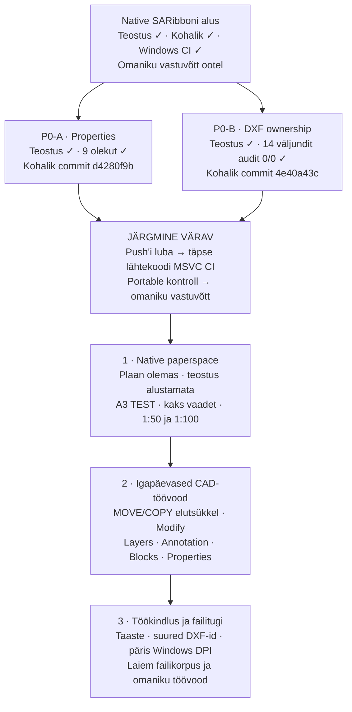
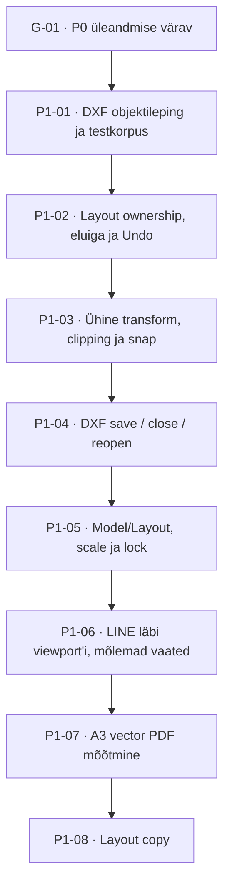

# Kuubik Draw Native roadmap

## Jälgitav tööplaan

**Uuendatud:** 2026-09-05 19:03 EEST. **Vastutaja:** Codex, integratsiooniomanik.
**Hetkel:** G-01 — ootab Reio push'i ja Windows MSVC CI luba.
**Viimane sündmus:** P0-B commit `4e40a43c` valmis; mõlemad P0 parandused on
lokaalselt kontrollitud. 9 Propertiesi olekut ja 14 ASCII-DXF-väljundit läbisid.

✓ tähendab ainult sõnaselgelt nimetatud kontrolli läbimist. Tulevikuetappide
protsente ega tähtaegu ei ole oletatud. Reprodutseeritav P0 viga tõuseb järjekorra ette.

| Töö | Teostus | Kohalik kontroll | Windows MSVC CI | Omaniku vastuvõtt |
|---|---|---|---|---|
| SARibboni alus, `d35ec354` | Valmis | Läbitud | Läbitud: `33966232573` | Ootel |
| P0-A Properties | Valmis | 9/9 olekut | Ootel | Ootel |
| P0-B PLOTSETTINGS | Valmis | 14 väljundit: audit 0/0 | Ootel | Ootel |
| Native paperspace | Alustamata | Puudub | Puudub | Puudub |
| AutoCADi-laadsed MOVE/COPY töövood | Planeeritud; native alus olemas | Täielik töövoog tõendamata | Täielik töövoog tõendamata | Puudub |
| Laiem töökindlus ja failitugi | Planeeritud | Osaline senine korpus | Osaline senine korpus | Puudub |

## Praegu — P0 parandused ja üleandmine

### P0-A · Propertiesi dokumendikokkuvõte

**Seis:** teostatud ja lokaalselt kontrollitud; commit `d4280f9b`.

- [x] Leida muutmisteavituse juurpõhjus ja asjakohased kutsujad.
- [x] Kasutada native dokumenditeavitust; vältida timer'it, polling'ut ja teist mudelit.
- [x] Lugeda ainult aktiivsed entity'd, välistades Undo tõttu alles hoitud objektid.
- [x] Kontrollida LINE → save ning PLINE → save → Undo → save → Redo → save.
- [x] Kontrollida kõiki 9 entity/Modified olekut: enne parandust 8 viga, pärast 0.
- [x] Säilitada selection, layer, MDI ja native Undo/Redo töövood.
- [ ] Läbida sama lähtekoodi Windows MSVC CI ja portable-kordus.
- [ ] Reio kontrollib tegelikus töövoos entity count'i ja Modified-näitu.

**Lõpetamise tingimus:** õige näit pärast iga nimetatud tegevust, olemasolevad
töövood säilinud ning uus Windowsi artifact sama lähtekoodiga tõendatud.

### P0-B · PLOTSETTINGSi DXF ownership

**Seis:** teostatud ja lokaalselt kontrollitud; commit `4e40a43c`.

- [x] Luua audit-clean sünteetiline modelspace-sisend; vana fixture säilitada.
- [x] Reprodutseerida enne parandust repair 202, mitte lugeda ainult geomeetriat.
- [x] Lisada ACAD_PLOTSETTINGS dictionary, owner, reactor ja unikaalsed kirjevõtmed.
- [x] Kontrollida 0, 1 ja 2 PLOTSETTINGS-objekti ning sama writer'i korduskasutust.
- [x] Nõuda puhtalt sisendilt ja 14 väljundilt 0 audit error'it ning 0 repair'i.
- [x] Kontrollida geomeetria, kihtide, ühikute, margin'ite ja native reopen'i säilimist.
- [x] Hoida binary-DXF päise leitud viga eraldi lahtise tööna F-01.
- [ ] Läbida sama lähtekoodi Windows MSVC CI ja portable-kordus.
- [ ] Reio kontrollib sünteetilise DXF-i avamist, muutmist ja taasavamist.

**Lõpetamise tingimus:** PLOTSETTINGS säilib ka sõltumatu auditi mälus;
ownership on korrektne ja nimetatud ASCII-korpus ei vaja struktuuriparandusi.
See ei tähenda suvalise DXF-i täielikku kadudeta tuge.

### G-01 · Windowsi tõend ja omaniku kontroll

**Seis:** ootel. **Sõltub:** P0-A + P0-B lokaalsetest commit'idest ning Reio loast.

- [ ] Reio lubab tööharu push'i ja olemasoleva Windowsi CI käivitamise.
- [ ] Push täpsele tööharule; MSVC x64 / Qt 5.15 build sama lähtekoodi pealt.
- [ ] Native GUI, Properties, DXF, PDF/SVG ja standalone ownership-testid läbivad.
- [ ] Portable kaust sisaldab õigeid runtime-faile, litsentse ja build-manifesti.
- [ ] Paketi enda Qt pluginad, isoleeritud profiilid ja muutumatu register on tõendatud.
- [ ] ZIP/SHA-256, CI run ja source commit on omavahel kontrollitud.
- [ ] Kohalik portable-kordus ja Reio vastuvõtt on eraldi registreeritud.

**Värav ei anna release'i või remote merge'i luba.** Viimane senine MSVC-tõend
on jätkuvalt `d35ec354` / run `33966232573`, kuni uus kontroll on läbitud.

## Järgmisena — native paperspace

**Kõigi P1 tööde seis: planeeritud, teostus alustamata.** Detailne tehniline alus:
[PAPERSPACE_PLAN](PAPERSPACE_PLAN.md). Enne arhitektuuri teostamist tehakse stage 0
ülevaatus koos planning/doubt-driven oskustega. Üks RS_Graphic ja üks native Undo
jäävad kõigis sammudes ainsaks mudeliks.

| ID | Töö ja tulemus | Vastuvõtukriteerium | Sõltub |
|---|---|---|---|
| P1-01 | LAYOUT, VIEWPORT, BLOCK_RECORD ja layout'i PLOTSETTINGS lugemise/kirjutamise leping | Sünteetilised failid katavad ID-d, owner'id, seosed, ühikud ja toetamatute objektide piirid; sõltumatu audit on 0/0 | Stage 0 ülevaatus |
| P1-02 | Native layout'i ja viewport'i omand ning eluiga | Üks RS_Graphic; layout TEST; ühine mudel; native Undo taastab lisamise/kustutamise ilma dangling pointer'ite või teise entity-mudelita | P1-01 |
| P1-03 | Ühine model↔paper teisendus | Renderdus, hit-test, snap ja PDF kasutavad sama teisendust; 0°/30°, inverse, clipping ja ühikud läbivad kontrolli | P1-02 |
| P1-04 | Layout/viewport DXF roundtrip | Save → close → reopen säilitab ID-d, owner'id, mõõtkavad ja lukud; geomeetria säilib ning sõltumatu audit on 0/0 | P1-01–03 |
| P1-05 | Model/Layout sakid, scale ja lock | A3 landscape TEST; kaks ligikaudu 160×160 mm viewport'i; 1:50 ja 1:100; sõltumatu camera; lock peatab wheel zoom'i mõju scale'ile | P1-04 |
| P1-06 | Mudeli muutmine läbi viewport'i | Topeltklõps sees → ModelThroughViewport, väljas → Paper; LINE ilmub mõlemas vaates; üks Undo/Redo uuendab mõlemat | P1-03–05 |
| P1-07 | Mõõtkavatäpne vektor-PDF | 1:1 A3 paber; 5000 mm LINE mõõdab vastavalt 100 ja 50 mm; tolerants ≤0,05 mm; geomeetria ei ole raster | P1-04–06 |
| P1-08 | Layout copy | Koopia saab eraldi layout/viewport ID-d, näitab sama mudelit ning säilitab oma camera, scale'i ja lock'i ka reopen'i järel | P1-07 põhivoo tõend |

**P1 koondvastuvõtt:** kõik kaheksa rida ei ole üks automaatne PASS. Põhislice'i
värav on P1-01–07 ühine native töövoog, sõltumatu DXF/PDF mõõtmine, Windows CI
ja Reio katse. Layout copy tuleb alles pärast põhivoo tõendamist.

**Esimesest slice'ist väljas:** DWG/XREF, annotative scale, mitteristkülikuline
clipping, 3D ja uus PDF runtime. Kasutaja layout-DXF-e ei kirjutata üle enne
tõendatud roundtrip'i; katsed kasutavad sünteetilisi faile või koopiaid.

## Seejärel — igapäevased CAD-töövood

**Seis:** native käsud on osaliselt olemas; allolev täielik AutoCADi-laadne
kasutusjada pole veel tõendatud. Järjekord järgib praegust kinnitatud suunda;
omaniku reprodutseeritud regressioon tõuseb kohe ette.

| ID | Funktsioonirühm | Konkreetsed tööd | Millal saab kontrolli läbituks märkida? |
|---|---|---|---|
| C-01 | MOVE | Valik → base point → target point; pointer ja koordinaadisisend; native preview/commit | Enter/Esc, lõppgeomeetria, üks Undo ning DXF reopen läbivad sama töövoo; praegune dialoogipõhine test üksi ei piisa |
| C-02 | COPY | Valik → base point → target point; kopeerimise jätkamine ja lõpetamine | Originaal säilib, koopiad on õigetes punktides; ühine Undo/Redo ja reopen; praegune in-place duplikaat üksi ei piisa |
| C-03 | OFFSET | Kaugus, lähteobjekt, pool; LINE/PLINE/ARC toetuse piiride kontroll | Mõõdetud kaugus, native geomeetria ja Undo/reopen on õiged; piirangud nähtavad |
| C-04 | TRIM ja EXTEND | Piiride valik, lõigatava/pikendatava osa määramine, tühistamine | Lõikepunktid ja säiliv geomeetria on sõltumatult kontrollitud, üks native Undo taastab lähteoleku |
| C-05 | FILLET | Raadius, kahe objekti valik, preview ja commit | Raadius/tangents ning lõigatud osad vastavad sisendile; Undo/Redo ja reopen säilivad |
| C-06 | ROTATE ja ERASE | Base point/nurk; valiku kustutamine | Täpsed koordinaadid või aktiivsete üksuste eemaldamine; üks Undo; Properties uueneb |
| C-07 | CIRCLE, ARC, RECTANGLE | Native pointer-testid, valikud ja koordinaadid | Nähtav käivitamine → canvas → päris entity → save/reopen; olemasolev nupp üksi ei ole tõend |
| L-01 | Layers | Color, visibility, lock, lineweight; current-layer ja entity omaduste kooskõla | Joonistamine kasutab õiget kihti; peidetud/lukustatud kihi töövood ja DXF taasavamine on tõendatud |
| A-01 | Text | Ühe- ja mitmerealine tekst, stiilid, muutmine, fondiasenduse piirid | Sisu, asukoht ja stiil säilivad; vector PDF ja reopen on kontrollitud |
| A-02 | Dimensions ja leaders | Mõõdutüübid, stiilid, täpsus ja juhtjooned | Mõõdetav väärtus vastab geomeetriale ning ei muutu save/reopen/PDF järel |
| A-03 | Hatch | Piirid, muster, scale/angle ja muutmine | Kinnised piirkonnad, avad, Undo ja eksport läbivad määratletud korpuse |
| B-01 | Blocks | Create, insert, edit, explode ja atribuutide toetuse piirid | Native blokkide seosed ja geomeetria säilivad Undo/Redo ning DXF roundtrip'is |
| PR-01 | Muudetav Properties | Ühe ja mitme valiku muudetavad omadused, segaväärtused | Muudatus läbib native tegevust ja ühist Undo't; valik/MDI/layer säilivad; read-only aluse olemasolu ei ole lõpptulemus |

Kõigi ridade ühine nõue: olemasolevad QAction/ActionHandler ja native entity'd,
üks dokumendimudel, sama preview/commit-geomeetria, Enter/Esc ning vajalik
command-line/dynamic-input/snap-käitumine. Täpset toetatud alamhulka laiendatakse
tõendite järgi; terve käsurühm ei saa ühe juhtumi põhjal rohelist staatust.

## Hiljem — töökindlus, visuaalne vastavus ja failikorpus

| ID | Töö | Praegune seis | Vastuvõtuvärav |
|---|---|---|---|
| F-01 | Binary-DXF päise viga | Leitud uurivas katses; native reopen exit 3, sõltumatu parseri tag 2304 | Eraldi red/green regressioon; binary open/save/reopen ja 0/0 audit määratletud korpusel |
| F-02 | Tundmatute/puudulikult toetatud DXF objektide ohutus | Täielik kadudeta säilimine tõendamata | Objekte ei kaotata vaikselt; toetatud säilitamine või selge ohutu piirang, sõltumatu korpus |
| R-01 | Autosave ja recovery | Pärandatud aluse töökindlus vajab eraldi tõendit | Katkestus/crash → taastamine säilitab lubatud töö; originaalfaili ei rikuta |
| R-02 | Suured DXF-id ja mälu | Suure korpuse benchmark puudub | Lepitakse kokku realistlikud joonised ja piirid; mõõdetakse open, edit, Undo, save ja mälu |
| R-03 | Puuduvad fondid ja linetype'id | Laiendatud korpus puudub | Ettearvatav asendus/hoiatus; geomeetria ja faili ohutus säilivad |
| V-01 | Päris Windows DPI ja mitu monitori | Qt 100/125/150% katsed olemas; Windows Settings kontroll puudu | Füüsilised kuva-/DPI-muutused, liikumine monitoride vahel, tab order ja puuduv clipping |
| V-02 | AutoCAD 2024.1.2 paigutuse ja töövoo võrdlus | SARibboni kontrollitud osad olemas; täielik vastavus tõendamata | Sama oleku võrdlused ja omaniku töövood; privaatseid referentse ega Autodesk vara ei avaldata |
| F-03 | Laiem DXF/DWG/DWT/XREF hinnang | Eksperimentaalne / sertifitseerimata | Tasuta ja GPLv2-ga ühilduv tee, ulatuslik säilivuskorpus, packaging/licensing enne runtime-valikut |
| REL-01 | Uus avalik preview / installer / allkirjastamine | Eraldi otsus; praegu luba puudub | Täpse lähtekoodi CI, native töövood, failiaudit, runtime/litsentsid, Gitleaks, SHA-256 ja omaniku avaldamisluba |

Tasulised ODA/RealDWG/ARES SDK-d, teine CAD-mootor ning 3D/BIM ei ole plaani osa.
ACadSharp on ainult uurimiskandidaat; praegusele tootele ei lisata .NET runtime'i.

### Uuendamise kokkulepe

See fail on jälgimiseks avatud püsiv plaan. Arendaja uuendab ajatembrit, aktiivset
töö-ID-d, märkeruute ja tõendiviiteid töö alustamisel,
testitulemuse saabumisel, commit'i järel ning blokeeringu või järjekorra muutumisel,
samas tööetapis, mitte alles lõpparuandes. Uus funktsioon saab kohe rea või etapi.
Teostus, kohalik kontroll, Windows CI ja omaniku vastuvõtt jäävad eraldi.
Vestluses näidatud skeem on avaldamishetke seis; sama faili vaade on jooksev plaan.
Ajahinnang lisatakse alles konkreetse slice'i ulatuse ja võimekuse hindamise järel.

Tõendid: [P0_CORRECTIONS](P0_CORRECTIONS.md), [TEST_REPORT](TEST_REPORT.md).

### Viimased muudatused

- 2026-09-05: P0-A kohalik commit; 9/9 Propertiesi kontrolli läbitud.
- 2026-09-05: P0-B neli adapteri- ja kümme GUI-väljundit audit 0/0; CI ootel.
- 2026-09-05 18:55 EEST: Reio soovil lisatud detailne graafiline järjekord,
  püsivad töö-ID-d, kontrollkriteeriumid ja jooksva uuendamise kokkulepe.
- 2026-09-05 19:03 EEST: P0-B commit `4e40a43c`; aktiivne töö liikus G-01 väravale.

Varasema UI-etapi päevik: [DEVELOPMENT_PLAN](DEVELOPMENT_PLAN.md).
Tasuta komponentide valiku ja piirangute alus: [RESEARCH_NOTES](RESEARCH_NOTES.md).
