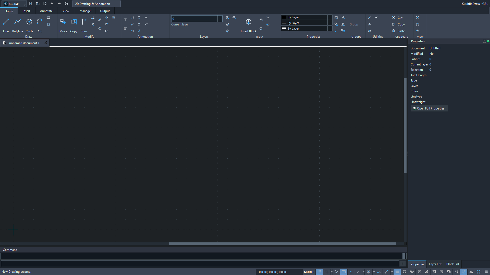

# Native paperspace foundation — 2026-09-05

Development checkpoint on `codex/autocad-visual-integration-root`; no release or
remote merge. The executable remains the offline Qt/LibreCAD application with
one native geometry model and shared Undo. No product runtime dependency was added.

- Executable source: `81103460ba46f0cecb79da00764b8a7d99832e41`.
- [Windows MSVC run 33990304131](https://github.com/T3stin-svg/kuubik-draw-native/actions/runs/33990304131): all gates passed.
- Portable ZIP: `KuubikDraw-0.2.0-preview.2-win64.zip`, 43,811,683 bytes.
- SHA-256: `33290170ddb43cb501308a9f5e665a1dffc3da96b67cf9bdc2cbb0da9ee67854`.
- Downloaded source/run manifest, checksum and full local packaged replay pass,
  including ten isolated processes, unchanged registry, independent file/ribbon
  checks, six negative PDF probes and the three forced settings failures.

The six native-generated files here are byte-exact copies of the CI evidence;
`SHA256SUMS.txt` covers them. They contain synthetic drawings and Qt widget captures,
with no user drawings, private screenshots, settings INIs or crash dumps.
The complete downloaded CI evidence contains 302 files and passes Gitleaks.



The image is a 1920×1080 Qt client-widget capture. The separate
[vector probe](viewport-transform-probe.pdf) tests camera math and clipping;
it is not an implemented native layout plot workflow.

## Implemented scope and checks

| Change | Evidence gate |
|---|---|
| Properties document summary | Nine entity/Modified states, immediate native notifications |
| PLOTSETTINGS ownership | Four standalone and ten GUI ASCII outputs, audit 0/0 |
| Bounded libdxfrw layout read/write | Camera/owner records, nine written outputs, twenty-one replacement/failure cases |
| Native paperspace save guard | Twenty-two native imports: sixteen protected cases and six ordinary model saves |
| Native layout metadata and shared Undo | Fifty-four identity/lifetime/Undo checks, no copied model geometry |
| Shared Qt camera foundation | Thirty-six numeric/clip checks; vector probe measures 100/50 mm, signed angles; six malformed PDF probes rejected |
| Isolated settings diagnostics | Three real locked-INI/report/combined failures retain statuses and stderr; no weakened isolation |
| Binary DXF Boolean width | Fifteen outputs across AC1015/1018/1021/1027/1032, defaults/false/true, native reread and independent audit 0/0 |

Existing native LINE/PLINE, COPY/MOVE Undo/Redo, layer, Tool Options, ribbon and
DXF/PDF/SVG gates remain required. DPI captures use qwindows and Qt scale factors;
they do not certify physical Windows Settings scaling or multiple monitors.

## Reproduce the independent evidence checks

Use the recorded source and a fresh download directory. The complete CI artifact
contains the companion drawings and reports that the six-file summary omits:

```powershell
gh run download 33990304131 --repo T3stin-svg/kuubik-draw-native --name KuubikDraw-0.2.0-preview.2-gui-evidence --dir .artifacts/evidence-replay-33990304131
python scripts/verify-preview-outputs.py ".artifacts/evidence-replay-33990304131/Kuubik Draw portable smoke"
python scripts/test-viewport-probe-verifier.py ".artifacts/evidence-replay-33990304131/Kuubik Draw portable smoke/gui-evidence/viewport-transform-probe.pdf"
python scripts/verify-ribbon-layout.py ".artifacts/evidence-replay-33990304131/Kuubik Draw portable smoke/dpi-evidence/reference/kuubik-ui-contract.json" --exact-reference
```

These developer checks use ezdxf 1.4.4, Pillow and pypdf. The application itself
does not need Python. GitHub artifacts have finite retention; the development
AI handoff includes an evidence ZIP, source ZIP, portable ZIP and their SHA-256s.

## Limits and continuation

The libdxfrw layout writer is a bounded file contract. Native layout import/export,
paper entities, Model/Layout tabs, model-through-viewport editing and native layout
plotting are unfinished. The Qt PDF is a camera/painter probe. Native Save As still
writes ASCII; the binary codec fix does not add a binary Save As workflow.
Detected paperspace remains protected against destructive Save/Save As/autosave.

The first local replay of the earlier `a601e807` package stopped before UI creation
on a QSettings sync error; the unchanged package's full fresh-profile retry passed.
Both outcomes are retained locally. Diagnostics identify the settings failure,
but the original environmental cause is unproved. Private dumps and settings INIs
are not part of this evidence.

Next: validated source dictionary/identity bindings and proven DCS/WCS conversion,
then native Save → close → reopen. See [PAPERSPACE_PLAN](../../../docs/PAPERSPACE_PLAN.md),
[live ROADMAP](../../../docs/ROADMAP.md), [TEST_REPORT](../../../docs/TEST_REPORT.md)
and [owner checklist](../../../docs/OWNER_REVIEW.md).
