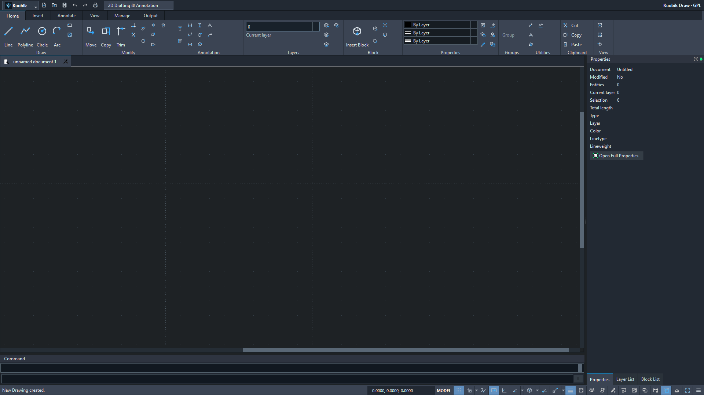

# SARibbon native development checkpoint — 2026-09-05

This is development evidence, not a release or an AutoCAD parity certificate.

- Executable source: `d35ec35486912e4bca1fdc2a7125ecc6d53580eb`.
- [Windows CI 33966232573](https://github.com/T3stin-svg/kuubik-draw-native/actions/runs/33966232573), all gates passed.
- Portable ZIP: `KuubikDraw-0.2.0-preview.2-win64.zip`, 43,773,937 bytes.
- Portable SHA-256: `4c3a2d8c2e36918e3fa77b0c106a174d1ea01bf27b6ecb0ea8d3400fa1c382d0`.

The 37 native-generated evidence files are byte-exact copies of this CI artifact.
They contain synthetic drawings and Kuubik/LibreCAD artwork, not client drawings,
private AutoCAD screenshots, local settings or desktop screenshots. Native JSON
and PNGs use the same tested executable. `SHA256SUMS.txt` covers the CI files.



The reference is a 1920x1080 **Qt client-widget capture**, not a complete OS screen.
All ten Home panel boundary deltas are zero against the recorded width contract.
100/125/150% cases use QT_SCALE_FACTOR; Windows Settings DPI changes are not claimed.
`workspace-idle.png` is captured before behavioral contracts; `workspace.png`
shows the post-test state. Four Draw commands remain directly visible at narrow widths.

Reproduce the independent checks from the repository root:

```powershell
python scripts/verify-preview-outputs.py evidence/development/2026-09-05-saribbon
python scripts/verify-ribbon-layout.py evidence/development/2026-09-05-saribbon/dpi-evidence/reference/kuubik-ui-contract.json --exact-reference
```

The first command needs ezdxf, Pillow and pypdf in the developer environment only.
The portable application has no Python/Node/.NET dependency.

The same ZIP passed local Windows replay, including ten isolated profile checks,
unchanged native registry, independent files and strict ribbon geometry. Separate
Windows pointer input created a 62.5 mm LINE and saved it into a synthetic DXF.
Those local desktop captures are deliberately not published.

Limits: no true paperspace, no lossless arbitrary DXF/DWG claim, no complete AutoCAD
command/visual comparison. A stricter ezdxf object audit finds one inherited
orphan PLOTSETTINGS record (repair 202); tested model-space geometry remains intact.
The native Properties document summary can lag drawing/save changes until another
refresh. See [TEST_REPORT](../../../docs/TEST_REPORT.md) and
[NEXT_TASKS](../../../NEXT_TASKS.md) for exact findings and next work.
