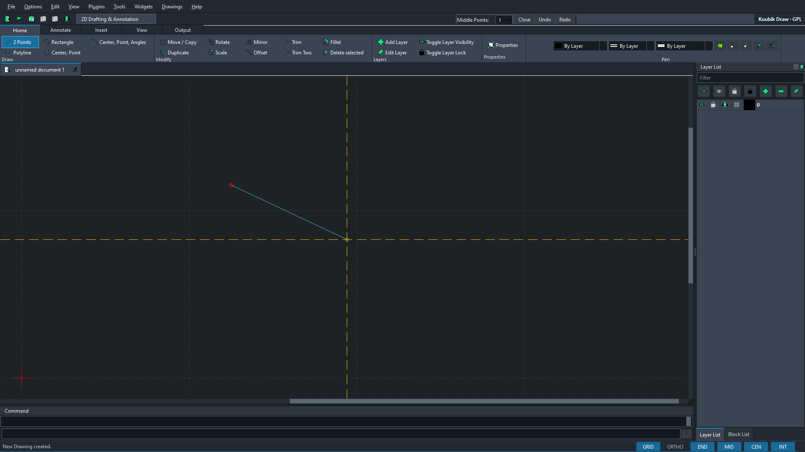
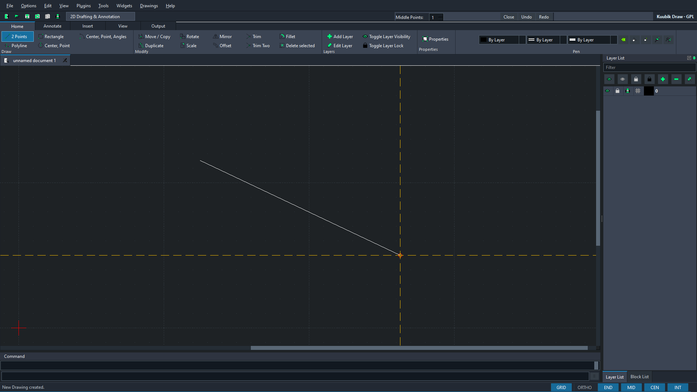

# Public GUI evidence — v0.2.0-preview.2

This directory contains the sanitized evidence for the native ribbon LINE
workflow. Every file is generated from an empty synthetic drawing.

## `ci-offscreen`

Generated by Windows GitHub Actions run
[33510020896](https://github.com/T3stin-svg/kuubik-draw-native/actions/runs/33510020896)
with Qt's packaged offscreen plugin:

- `line-active.png` — first point committed and pointer preview visible;
- `line-committed.png` — exactly one native LINE after the second click;
- `line-gui-smoke.json` — machine-readable action, click and entity counts;
- `line-gui-smoke.dxf` — saved native drawing used for independent read-back.

Offscreen rendering on the hosted Windows runner does not render all Segoe UI
text glyphs. It is retained as the reproducible CI proof of geometry and widget
state, not as the final typography reference.

## `windows-local`

Generated from the downloaded and checksum-verified portable ZIP on a normal
Windows desktop at 1920×1080 and 96 DPI. These images are the visual reference
for the actual local UI. The JSON and DXF repeat the same native workflow.

Active LINE preview:

Committed native LINE:

The local DXF contains exactly one LINE. Independent `ezdxf` read-back found
start `(122.0, 115.25, 0.0)`, end `(256.5, 50.0, 0.0)`, and length
`149.49184760380749`.

See `SHA256SUMS.txt` for content hashes and `release-manifest.json` for the
source, release, CI and artifact relationship.

No client data, private AutoCAD image, local path, credential or settings file
is included.
